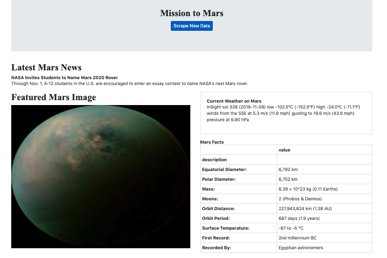
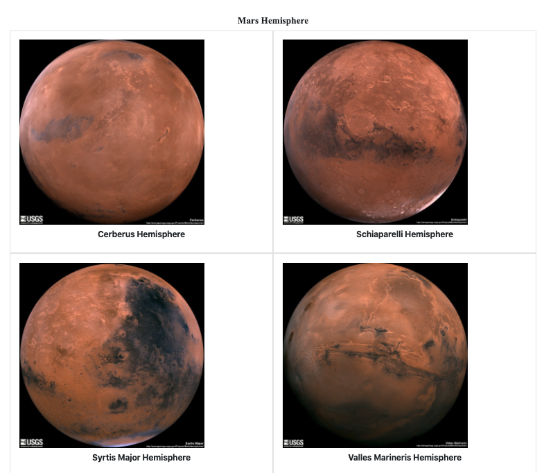

# Web Scraping on Mars

## Summary
An interactive web application that scrapes various websites (NASA.gov and Twitter)  for data related to the Mission to Mars; and displays the information in a single HTML page on a local server, utilizing local MongoDB database, Python, Pandas, Flask PyMongo, Beautiful Soup, Splinter Browser, JavaScript and JavaScript packages (JQuery, Bootstrap and Popper) to create a RESTful API app with two routes. Each time a user clicks the "Scrape New Data" button, images, news articles and twitter info are refreshed.

## Web Page Output

